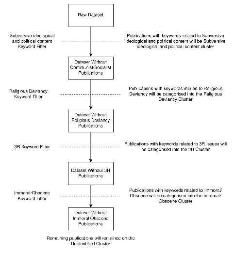

## Research Methods

## Method I: Data Collection

## Importation of Data from the Ministry of Home Affairs

To import the metadata from the KDN dataset. We first copy the source code from their website which contains the database (**Senarai Perintah Larangan** — TODO(sourcing): the URL this was taken from, https://epq.kdn.gov.my/e-pq/index.php?mod=public, no longer resolves; replace with a working link or an archived capture) and additional justification list officially inquired from Kementerian Dalam Negeri, Bahagian Penguatkuasaan & Kawalan, that contain the justifications of each prohibition. Thanks to KDN for responding to our request. The metadata include:

1. Publication Title / Tajuk Penerbitan   
2. Author / Translator / Pengarang / Penterjemah  
3. Publisher / Penerbit  
4. Printer / Pencetak   
5. Gazette Date / Tarikh Warta   
6. Language / Bahasa  
7. Categories of Undesirable Publications / Kategori Penerbitan Tidak Diingini \- According to the Publication Guidelines under the PPPA, the guidelines explain the definitions of the categories of banning below:  
   1. Contrary to Law / Berlawanan dengan Undang-Undang \- Publications that conflict with the Federal Constitution, federal or state laws, regulations, official rules, or official fatwas issued by competent authorities.  
   2. Morality / Kemoralan \- Publications that contain obscene, sexually suggestive, indecent, or immoral content that conflicts with public decency, social values, moral conduct, or religious beliefs.  
   3. Public Interest / Kepentingan Awam \- Publications containing reports, articles, images, illustrations, or statements that go against public interest, community interests, or religious beliefs.  
   4. National Interest / Kepentingan Negara \- Publications that may harm the country’s political, economic, or social interests.  
   5. Security / Keselamatan \- Publications that may threaten national security by raising sensitive constitutional matters, undermining the monarchy or Rukun Negara, spreading ideologies contrary to Malaysia’s democratic system, or distorting facts in a way that could endanger national security.  
   6. Public Order / Ketenteraman Awam \- Publications that may threaten public order by encouraging violence, disturbing peace, promoting hostility between communities, spreading deviant or misleading religious teachings, or challenging core sources of Islamic law.  
   7. Causing Public Alarm / Menggemparkan Fikiran Orang Ramai \- Publications that may cause public alarm by exaggerating, sensationalising, misleading, or spreading false or baseless information that creates confusion, doubt, anxiety, or fear among the public.

From there we used Claude to generate a code that will extract all the data contained inside the source code and return a comma separated value (.CSV) files for the raw data. The decision to use Claude here is to prevent any hallucination by directly using a script instead. Any future update to the database is done by monitoring the data on the website or through news and manually inserting the new entries. 

KDN justification list

## Method II: Human and AI-Powered Review

This research employed both human and AI-powered data collection and review processes. The researchers then reviewed the dataset in a few phases:

- identified whether the metadata itself is correct and accurate. Some metadata inaccurate and mislabeled, so they are being corrected. For examples: however as mentioned in the research limitations there are still many details that are unknown esp during the period of…. due to its untraceability.  
- Formulate taxonomies based on the needs of the research such as publication types and origin   
  - Publication Types / Jenis Penerbitan (Section 7 of the PPPA)  
    1. Printed Documents: Books, pamphlets, magazines, journals, and newspapers  
    2. Visual Media: Photographs, caricatures, drawings, maps, charts, and posters.  
    3. Audio/Recordings: Sound recordings, music, tapes, and discs.  
    4. Digital/Electronic: Computer databases, internet publications, and microfilm.  
    5. Physical Goods: Items with symbolic content, such as clothing, watches  
  - Publication Origin / Asal Penerbitan  
    - Local   
    - Foreign   
    - Both   
    - Unclear  
- and dominant themes of prohibited items to identify clusters and sub-clusters  
  - Subversive ideological and political content  
    * Communism/socialism  
    * Revolutionary politics  
    * Terrorism / militancy  
    * LGBT  
- Race, religion & royalty (3R issues)  
  * Ethnic incitement  
    * Insults to religion  
    * Insults to Royalty  
- Religious doctrinal deviance  
  * Al-Arqam  
    * Syiah  
    * Ahmadiyyah  
    * Others  
- Obscene / immoral publications  
  * Erotic /immoral content  
    * Pornography  
- General / Unidentified  
  * Multiple grounds  
    * Administrative / unclear rationale

### **How was the classification of the taxonomies made and reviewed?**

For the classification of clusters and sub-clusters, the data scientist used a combination of embedding based classification and keyword-based rules which is used mostly for verification. The data scientist combined the publication’s metadata into a single text string and then encoded into a dense vector using a multilingual sentence transformer model. 

Three models were evaluated during this process:

| Model | Notes |
| :---- | :---- |
| paraphrase-multilingual-mpnet-base-v2 | Baseline model. It was used in preliminary analysis. Provides weaker multilingual clustering output. |
| intfloat/multilingual-e5-large | Strong multilingual performance across 100+ languages. |
| BAAI/bge-m3 | State-of-the-art multilingual, handles short text well. |

The classification uses a semi-supervised approach called anchor-based nearest-centroid classification:

**Step 1: Anchor Selection**

 A set of anchor publications are manually identified for each sub-cluster. These are publications with unambiguous cluster assignments based on known publishers, authors, or title content. A total of 265 anchors were defined across 13 sub-clusters, with the number per sub-cluster ranging from 2 (Ethnic incitement) to 68 (Al-Arqam).

**Step 2: Centroid Computation**

For each sub-cluster, the centroid is computed as the mean of its anchor embeddings, then L2-normalised. This centroid represents the “typical” position in embedding space for that sub-cluster.

**Step 3: Assignment**

Every publication is assigned to the sub-cluster whose centroid has the highest cosine similarity to its embedding. The similarity score serves as a confidence measure.

**Step 4: Confidence Thresholding**

Publications with similarity scores below a threshold are flagged as low-confidence and routed to manual review or to Cluster 5 (General/Unidentified).

**Revised Method: Rule Based Keyword Classifier**

  
*Figure x.x: The Publications Data Will be Put Through Keywords Pipeline Based on the cluster and subcluster*

The initial screening stage is done by using a script that will filter out the publications based on keywords. These keywords are generated mostly through the use of various LLM to try to cover as many grounds as possible. The LLM used to generate the keywords are; OpenAI’s ChatGPT 5.4, Anthropic’s Claude Opus 4.6 and Deepseek. This method allowed us to have more control over the classification while still utilising AI’s technology. The following table shows all the keyword types and the examples of keywords used.

This table maps every keyword, publisher name, and author name used in the rule-based classifier to its corresponding Cluster and Sub-cluster. Priority order: publisher keywords are checked first, then author, then title (combined last). Earlier rules win.

**Colour legend:** Yellow \= Religious Deviance  |  Blue \= Subversive/Political  |  Green \= 3R Issues  |  Orange \= Obscene/Immoral  |  Grey \= Fallback

| Keyword / Phrase | Field Checked | Cluster | Sub-cluster |
| :---- | :---- | :---- | :---- |
| **CLUSTER 1 — Religious Doctrinal Deviance** |  |  |  |
| al-arqam / al arqam / shoutul arqam / minda abuya / syeikhul arqam … | Publisher | Religious doctrinal deviance | Al-Arqam |
| ashaari muhammad / ashaari / abuya syeikh / khadijah aam / zulkifli bin ashaari | Author/Translator | Religious doctrinal deviance | Al-Arqam |
| darul arqam / al-arqam / al arqam / aurad muhammadiah / arqam militan / kahwin cara arqam | Publication Title | Religious doctrinal deviance | Al-Arqam |
| al-muntazar / zahra publishing / darul hadith | Publisher | Religious doctrinal deviance | Syiah |
| syiah / shi'a / shia islam / imam mahdi / bani tamim / imam khomeini | Publication Title | Religious doctrinal deviance | Syiah |
| ahmadi / anjuman / qadian | Title \+ Publisher \+ Author (combined) | Religious doctrinal deviance | Ahmadiyyah |
| perkhabaran injil / lembaga alkitab / watch tower bible / kalam hidup / baker book / bibles international / the gideon … (and others) | Publisher | Religious doctrinal deviance | Others |
| perjanjian baru / injil yohanes / alkitab / al-kitab / kristus / kristian / yesus / roh kudus / juru selamat | Publication Title | Religious doctrinal deviance | Others |
| ismaili | Title \+ Publisher \+ Author (combined) | Religious doctrinal deviance | Others |
| tujuh likur enterprise / pustaka jiwa / penerbit al-huda / jahabersa / thinker's library / forum iqra / pustaka dini / pustaka zahra … (and many others) | Publisher | Religious doctrinal deviance | Others |
| north africa mission / red sea mission / fellowship of faith for muslim / ywam publishing / ministries to muslim … (mission publishers targeting Muslims) | Publisher | Religious doctrinal deviance | Others |
| ajaran sesat / ilmu hakikat / tarekat / nadi insan / baha'i / bahai | Publication Title | Religious doctrinal deviance | Others |
| **CLUSTER 2 — Subversive Ideological & Political Content** |  |  |  |
| lesbian / bisexual / transgender / lgbtq / lgbt / homosexual / queer / same-sex / heartstopper / non-binary / nonbinary | Publication Title | Subversive ideological and political content | LGBT |
| gay (excluding gayong / gaya / gayo) | Publication Title | Subversive ideological and political content | LGBT |
| i am jazz / julian is a mermaid / grandad's camper / call me by your name / my shadow is purple / gakuen heaven / what if it's us … (known LGBT titles) | Publication Title | Subversive ideological and political content | LGBT |
| swatch \+ lgbtq / koleksi | Title \+ Publisher \+ Author (combined) | Subversive ideological and political content | LGBT |
| teenage \+ guide to \+ almost | Publication Title | Subversive ideological and political content | LGBT |
| people's publishing house / foreign languages press / liberation press / new china bookshop / communist party / china pictorial / sam luen bookshop … (and many others) | Publisher | Subversive ideological and political content | Communism/socialism |
| barisan sosialis / partai rakyat / parti buroh / pustaka tanah merah / wah tung bookshop / the seventies publishing … (Southeast Asian communist publishers) | Publisher | Subversive ideological and political content | Communism/socialism |
| m.c.p / m.r.l.a | Publisher | Subversive ideological and political content | Communism/socialism |
| Lenin / Stalin / Mao Tse / Mao Tze / Engels / Marx | Author/Translator | Subversive ideological and political content | Communism/socialism |
| communist / communism / marxis / leninis / proletari / bolshevik / soviet union / socialism / komunis / partai komunis | Publication Title | Subversive ideological and political content | Communism/socialism |
| red square / tentera pembebasan / gerilawati / dialectic materialism / kim il sung / people's republic / red flag / malayan monitor / daily worker / moscow news | Publication Title | Subversive ideological and political content | Communism/socialism |
| dialectical materialism / historical materialism / class struggle / means of production / planned economy / workers revolution / dictatorship of the proletariat / cultural revolution … (and extensive list of communist ideology terms) | Publication Title | Subversive ideological and political content | Communism/socialism |
| Soviet Union / USSR / People's Republic of China / Republic of Cuba / North Korea / Vietnam / Laos / Khmer Rouge Cambodia / East Germany / Yugoslavia / Albania … (communist states) | Publication Title | Subversive ideological and political content | Communism/socialism |
| fascis / british union quarterly | Publication Title | Subversive ideological and political content | Terrorism/Militancy |
| fascis | Title \+ Publisher \+ Author (combined) | Subversive ideological and political content | Terrorism/Militancy |
| **CLUSTER 3 — Race, Religion & Royalty (3R Issues)** |  |  |  |
| satanic verses | Publication Title | Race, religion & royalty (3R issues) | Insults to religion |
| anti islam / anti-islam / anti dakwah | Publication Title | Race, religion & royalty (3R issues) | Ethnic Incitement |
| nazi goreng / when i was a kid 3 | Publication Title | Race, religion & royalty (3R issues) | Racial/cultural insensitivity |
| belt and road / jalur dan jalan / win-winism / negara rakyat china / 3r and the dilemma / mic anti islam / racial discrimination | Publication Title | Race, religion & royalty (3R issues) | Ethnic Incitement |
| sultan ismail petra / dethroning | Publication Title | Race, religion & royalty (3R issues) | Royalty |
| **CLUSTER 2 — Subversive Ideological & Political Content** |  |  |  |
| suara demokrasi / seruan keadilan / bersih 4 / reformasi / march to putrajaya / funny malaysia / perak darul kartun / amnesty international / torture in malaysia / mahathir / trojan donkeys / hancurkan komplot / masturbasi / surat-surat dari langit | Publication Title | Subversive ideological and political content | Revolutionary politics |
| **CLUSTER 3 — Race, Religion & Royalty (3R Issues)** |  |  |  |
| risalah bertajuk / suratan bertajuk / suratan yang (+ islam / ugama / agama) | Publication Title | Race, religion & royalty (3R issues) | Insults to religion |
| **CLUSTER 2 — Subversive Ideological & Political Content** |  |  |  |
| risalah bertajuk / suratan bertajuk / suratan yang (no religion keywords) | Publication Title | Subversive ideological and political content | Revolutionary politics |
| partai rakyat | Title \+ Publisher \+ Author (combined) | Subversive ideological and political content | Revolutionary politics |
| teroris / al-fatihin / daulah islamiyyah / al-yahud / perjuangan kemerdekaan rakyat pattani / bargaining for israel | Publication Title | Subversive ideological and political content | Revolutionary politics |
| **CLUSTER 4 — Obscene / Immoral Publications** |  |  |  |
| olympia press / ophelia press / bee-line books / midwood publications / essex house / paul raymond / catalan communications / house of milan / panther books / alyson publications / cleis press … (Western pulp/porn publishers) | Publisher | Obscene / immoral publications | Pornography |
| jin tian press / tong li publishing / hong kong giant publishing / yuk long books / quan long press … (Chinese/HK publishers) | Publisher | Obscene / immoral publications | Pornography |
| amusement publishing / king kong publishing / majaya enterprise / penerbitan metrozone / lejen press / evil dead production / penerbitan kaki novel … (Malay/Indonesian publishers) | Publisher | Obscene / immoral publications | Pornography |
| eros publishing / brandon books / roafield / sin jin kang / pustaka suryabana / american art enterprises / vortex comics / rip off press / last gasp … (additional publishers) | Publisher | Obscene / immoral publications | Pornography |
| pornograph / bondage / orgy / bogel / gambar lucah / penthouse / playboy / hustler / playgirl / mayfair / blue film / striptease | Publication Title | Obscene / immoral publications | Pornography |
| seks / nafsu / ghairah / berahi / gasang / gersang / miang / genit / lucah / pelacur / rogol / erotic / seduction / kamasutra / lascivious / sexy / sensual / hubungan seks / erotica / xxx / nude / naked / telanjang / wanita malam / zina / skandal seks | Publication Title | Obscene / immoral publications | Erotic/immoral content |
| traveller's companion / grove press / book of the month club / vintage books / dorling kindersley (with erotic title signals) | Publisher | Obscene / immoral publications | Erotic/immoral content |
| **CLUSTER 5 — Fallback / Unmatched** |  |  |  |
| (no keyword matched) | — | General/Unidentified | Administrative/Unclear Ground |

